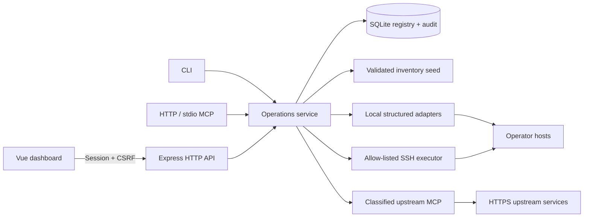

# Architecture

## Boundaries

`lib/config.js` validates inventory, SSH, and upstream definitions before they enter the operations layer. `lib/service-store.js` owns versioned SQLite migrations, host/group/service relations, soft deletion, Agent Token records, update cache, and audit events. Public DTOs omit probe URLs, environment-variable mappings, SSH targets, and every secret.

`lib/app-context.js` wires the shared `lib/operations.js` boundary. It resolves services, status/health, version checks, update plans, structured controls, SSH probes/commands, and upstream MCP calls. Every mutation requires authentication, scope checks, schema validation, and audit logging. High-impact or destructive operations additionally follow this order:

1. authenticated Session or Agent Token;
2. required scope;
3. `OPS_ENABLE_PRIVILEGED_OPERATIONS` and per-integration capability;
4. service/host allowlist and schema validation;
5. explicit `confirm: true`;
6. audit event with recursive secret redaction.

The command executor uses argv-based systemd/Docker/launchd operations. SSH commands are single-line strings evaluated against a deployment-owned prefix/regex allowlist. There is no default arbitrary shell or root terminal.

Upstream MCP uses HTTPS, protocol/session headers, bounded response sizes, environment-backed authorization or OAuth refresh, one-time credential/session recovery, and an explicit `toolPolicy`. Unknown tools and unclassified writes are denied.

## Frontend modules

- `useDashboardData` loads inventory, status, and version DTOs and keeps the dashboard cache bounded.
- `useServiceCommands` coordinates refresh/version/control operations and requires a browser confirmation before every service write.
- `ServiceDetailDrawer` displays the configured public metadata without exposing probes or credentials.
- `AdminWorkspace` provides authenticated registry, Agent Token, audit, configuration, SSH integration, and upstream MCP entry points. It never renders private keys or an unrestricted terminal.
- `src/api/dashboard.js` is the browser client contract; mutating requests carry the CSRF token and `credentials: include`.

## Deployment modes

The same code runs on one host or across any number of configured hosts. A local host uses structured runtime adapters; a remote host selects an SSH registry entry. The Vue build is static and can be served by Caddy/Nginx, while the Node API remains on loopback. See [deployment](deployment.md) and [CLI/MCP](cli-mcp.md) for the configuration surface.
